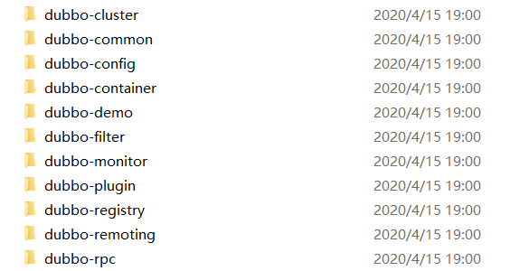
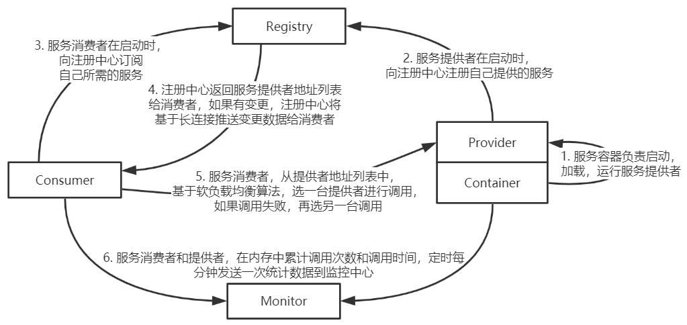

## 项目结构
首先从GitHub 上 down下来Dubbo项目，我们根据里面的目录名 也能大概猜出来各个模块的作用。

### dubbo-­common
公共逻辑模块，定义了各模块中 通用的 组件 和 工具类，如：IO、日志、配置处理等。

### dubbo-rpc
分布式协调服务框架的核心，该模块定义了 RPC相关的组件，包括 服务发布、服务调用代理、远程调用结果、RPC调用网络协议，RPC调用监听器和过滤器等等。该模块提供了默认的 基于dubbo协议的实现，还提供了hessian、http、rmi、及webservice等协议的实现，能够满足绝大多数项目的使用需求，另外 还提供了对自定义协议的扩展。
### dubbo­ registry
注册中心，它是 RPC 中 consumer 和 provider 两个重要角色的协调者，该模块定义了核心的 注册中心组件，提供了mutilcast、redis和zookeeper等多种方式的注册中心实现，用于不同的使用场景。
### dubbo­ remoting
远程通讯模块，RPC 的实现基础就是远程通讯，consmer 要调用 provider 的远程方法必须通过 远程通讯实现。该模块定义了远程传输器、endpoint 终端、客户端、服务端、编码解码器、数据交换、缓冲区、通讯异常定义 等核心组件。他是对于远程网络通讯的抽象，提供了诸如 netty、mina、http等 协议和技术框架的实现方式。
### dubbo ­monitor
监控模块，该模块可以监控服务调用的各种信息，例如调用耗时、调用量、调用结果等等，监控中心在调用过程中收集调用的信息，发送到监控服务，在监控服务中可以存储这些信息，对这些数据进行统计分析 和 展示。dubbo默认提供了一个实现，该实现非常简单，只是作为默认的实现范例，生产环境使用价值不高，往往需要自行实现。
### dubbo ­container
容器模块，是一个独立的容器，以简单的 Main(类) 加载Spring启动，因为服务通常不需要Tomcat/JBoss等Web容器的特性，没必要用Web容器去加载服务。
### dubbo ­config
dubbo配置模块，该模块通过 配置信息，将dubbo组件的各个模块整合在一起，给 框架的使用者 提供 可配置的、易用的 分布式服务框架。它定义了面向dubbo使用者的各种信息配置，比如服务发布配置、方法发布配置、服务消费配置、应用程序配置、注册中心配置、协议配置、监控配置等等。
### dubbo ­cluster 
集群模块，将多个服务提供方伪装为一个提供方，包括：负载均衡、容错、路由等，集群的地址列表可以是静态配置的，也可以是由注册中心下发。
### dubbo ­admin
该项目是一个web应用，可以独立部署，用于管理dubbo服务，该管理应用可以连接注册中心，读取和更新 注册中心中的内容。

## 实现原理
### 角色类型与运行原理
一个Dubbo项目 的角色主要分为如下五种。
- Provider：服务提供方；
- Consumer：服务消费方；
- Registry：服务注册与发现的注册中心；
- Container：服务运行容器；
- Monitor：统计服务的调用次数、调用时间 的监控中心。

其运行原理如下图所示。

### 工作原理
最后总结下其工作原理。
1. 服务导出：服务提供方 导出服务，监听服务端口；
2. 服务注册：服务提供方 注册服务信息到注册中心；
3. 服务订阅：服务消费方 订阅关注的服务；
4. 服务发现：当服务地址发生变更时，注册中心通知服务消费端；
5. 远程服务调用 (RPC) ：根据负载均衡策略 选择服务地址，直接调用；
6. 监控：监控器 收集和展示 服务提供方、服务消费方之间 的服务调用统计信息 。