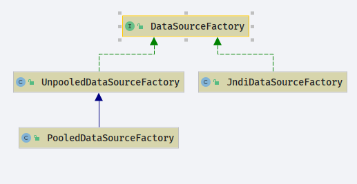
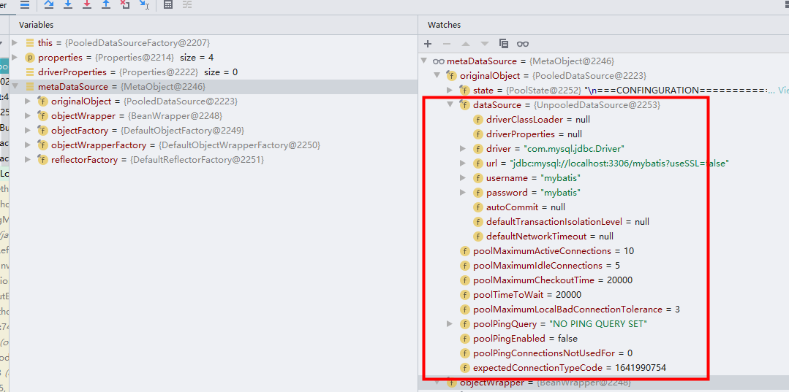

# Mybatis DataSource
- Author: [HuiFer](https://github.com/huifer)
- Description: 该文介绍 mybatis DataSource 源码
- 源码阅读工程: [SourceHot-Mybatis](https://github.com/SourceHot/mybatis-read.git)

- `org.apache.ibatis.datasource.DataSourceFactory`
```java
/**
 * 数据源工厂
 * @author Clinton Begin
 */
public interface DataSourceFactory {

    /**
     * 设置 dataSource 属性
     * @param props
     */
    void setProperties(Properties props);

    /**
     * 获取 dataSource
     * @return {@link DataSource}
     */
    DataSource getDataSource();

}

```

类图如下



- `setProperties`会将下列标签放入`datasource`中

```java
      <dataSource type="POOLED">
        <property name="driver" value="com.mysql.jdbc.Driver"/>
        <property name="url" value="jdbc:mysql://localhost:3306/mybatis?useSSL=false"/>
        <property name="username" value="mybatis"/>
        <property name="password" value="mybatis"/>
      </dataSource>
```


- 在`org.apache.ibatis.session.Configuration`中有配置下面三个信息
```java
        typeAliasRegistry.registerAlias("JNDI", JndiDataSourceFactory.class);
        typeAliasRegistry.registerAlias("POOLED", PooledDataSourceFactory.class);
        typeAliasRegistry.registerAlias("UNPOOLED", UnpooledDataSourceFactory.class);

```


## JndiDataSourceFactory

```java
/**
 * @author Clinton Begin
 */
public class JndiDataSourceFactory implements DataSourceFactory {

    public static final String INITIAL_CONTEXT = "initial_context";
    public static final String DATA_SOURCE = "data_source";
    public static final String ENV_PREFIX = "env.";

    /**
     * 直接 java 数据源
     */
    private DataSource dataSource;

    /**
     * 获取数据源的配置信息
     * @param allProps
     * @return
     */
    private static Properties getEnvProperties(Properties allProps) {
        final String PREFIX = ENV_PREFIX;
        Properties contextProperties = null;
        for (Entry<Object, Object> entry : allProps.entrySet()) {
            String key = (String) entry.getKey();
            String value = (String) entry.getValue();
            // 只获取前缀`env`
            if (key.startsWith(PREFIX)) {
                if (contextProperties == null) {
                    contextProperties = new Properties();
                }
                // 放入数据
                contextProperties.put(key.substring(PREFIX.length()), value);
            }
        }
        return contextProperties;
    }

    /**
     * 设置数据源属性
     * @param properties
     */
    @Override
    public void setProperties(Properties properties) {
        try {
            InitialContext initCtx;
            Properties env = getEnvProperties(properties);
            if (env == null) {
                initCtx = new InitialContext();
            } else {
                initCtx = new InitialContext(env);
            }

            if (properties.containsKey(INITIAL_CONTEXT)
                    && properties.containsKey(DATA_SOURCE)) {
                // 如果包含`initial_context`和`data_source`
                Context ctx = (Context) initCtx.lookup(properties.getProperty(INITIAL_CONTEXT));
                dataSource = (DataSource) ctx.lookup(properties.getProperty(DATA_SOURCE));
            } else if (properties.containsKey(DATA_SOURCE)) {
                dataSource = (DataSource) initCtx.lookup(properties.getProperty(DATA_SOURCE));
            }

        } catch (NamingException e) {
            throw new DataSourceException("There was an error configuring JndiDataSourceTransactionPool. Cause: " + e, e);
        }
    }

    @Override
    public DataSource getDataSource() {
        return dataSource;
    }

}
```

## PooledDataSource

```java
	protected int poolMaximumActiveConnections = 10;
    protected int poolMaximumIdleConnections = 5;
    protected int poolMaximumCheckoutTime = 20000;
    protected int poolTimeToWait = 20000;
    protected int poolMaximumLocalBadConnectionTolerance = 3;
    protected String poolPingQuery = "NO PING QUERY SET";
    protected boolean poolPingEnabled;
    protected int poolPingConnectionsNotUsedFor;
```


## PooledDataSourceFactory

```java
public class PooledDataSourceFactory extends UnpooledDataSourceFactory {


    public PooledDataSourceFactory() {
        this.dataSource = new PooledDataSource();
    }

}

	// 初始化
    public PooledDataSource() {
        dataSource = new UnpooledDataSource();
    }
```


## UnpooledDataSourceFactory

```java
    @Override
    public void setProperties(Properties properties) {
        Properties driverProperties = new Properties();
        //metaDataSource 现在是一个dataSource
        MetaObject metaDataSource = SystemMetaObject.forObject(dataSource);
        for (Object key : properties.keySet()) {
            String propertyName = (String) key;
            if (propertyName.startsWith(DRIVER_PROPERTY_PREFIX)) {
                // 如果是 driver. 前缀开头
                String value = properties.getProperty(propertyName);
                driverProperties.setProperty(propertyName.substring(DRIVER_PROPERTY_PREFIX_LENGTH), value);
            } else if (metaDataSource.hasSetter(propertyName)) {
                String value = (String) properties.get(propertyName);
                Object convertedValue = convertValue(metaDataSource, propertyName, value);
                // 通过 metaDataSource 来对 dataSource 进行设置属性
                metaDataSource.setValue(propertyName, convertedValue);
            } else {
                throw new DataSourceException("Unknown DataSource property: " + propertyName);
            }
        }
        if (driverProperties.size() > 0) {
            metaDataSource.setValue("driverProperties", driverProperties);
        }
    }

```


## UnpooledDataSource

- `org.apache.ibatis.datasource.unpooled.UnpooledDataSource`主要定义数据库连接相关的一些属性,以及与数据库的链接对象创建

  ```java
      // 一些配置信息
      private ClassLoader driverClassLoader;
      private Properties driverProperties;
      private String driver;
      private String url;
      private String username;
      private String password;
      private Boolean autoCommit;
      private Integer defaultTransactionIsolationLevel;
      private Integer defaultNetworkTimeout;
  ```

  

- 初始化连接对象

  ```java
      /**
       * 加载链接驱动 如 mysql 链接驱动
       * @throws SQLException
       */
      private synchronized void initializeDriver() throws SQLException {
          if (!registeredDrivers.containsKey(driver)) {
              Class<?> driverType;
              try {
                  if (driverClassLoader != null) {
                      driverType = Class.forName(driver, true, driverClassLoader);
                  } else {
                      driverType = Resources.classForName(driver);
                  }
                  // DriverManager requires the driver to be loaded via the system ClassLoader.
                  // http://www.kfu.com/~nsayer/Java/dyn-jdbc.html
                  Driver driverInstance = (Driver) driverType.getDeclaredConstructor().newInstance();
                  DriverManager.registerDriver(new DriverProxy(driverInstance));
                  registeredDrivers.put(driver, driverInstance);
              } catch (Exception e) {
                  throw new SQLException("Error setting driver on UnpooledDataSource. Cause: " + e);
              }
          }
      }
  
  ```

  

- 设置连接对象的属性

  ```java
      /**
       * 设置连接对象 , 超时时间,是否自动提交事物
       * @param conn
       * @throws SQLException
       */
      private void configureConnection(Connection conn) throws SQLException {
          if (defaultNetworkTimeout != null) {
              conn.setNetworkTimeout(Executors.newSingleThreadExecutor(), defaultNetworkTimeout);
          }
          if (autoCommit != null && autoCommit != conn.getAutoCommit()) {
              conn.setAutoCommit(autoCommit);
          }
          if (defaultTransactionIsolationLevel != null) {
              conn.setTransactionIsolation(defaultTransactionIsolationLevel);
          }
      }
  
  ```

  

- 获取连接对象

  ```java
      /**
       * 获取链接对象
       * @param username
       * @param password
       * @return
       * @throws SQLException
       */
      private Connection doGetConnection(String username, String password) throws SQLException {
          Properties props = new Properties();
          if (driverProperties != null) {
              props.putAll(driverProperties);
          }
          if (username != null) {
              props.setProperty("user", username);
          }
          if (password != null) {
              props.setProperty("password", password);
          }
          return doGetConnection(props);
      }
  
  ```

  


## 解析流程

- 在xml解析的过程中会执行`DataSourceFactory`相关内容

```java
    /**
     * 解析 dataSourceElement 标签
     * <dataSource type="POOLED">
     * <property name="driver" value="com.mysql.jdbc.Driver"/>
     * <property name="url" value="jdbc:mysql://localhost:3306/mybatis"/>
     * <property name="username" value="root"/>
     * <property name="password" value="root"/>
     * </dataSource>
     *
     * @param context
     * @return
     * @throws Exception
     */
    private DataSourceFactory dataSourceElement(XNode context) throws Exception {
        if (context != null) {
            String type = context.getStringAttribute("type");
            Properties props = context.getChildrenAsProperties();
            //org.apache.ibatis.session.Configuration.Configuration()
            DataSourceFactory factory = (DataSourceFactory) resolveClass(type).getDeclaredConstructor().newInstance();

            // PooledDataSourceFactory -> UnpooledDataSourceFactory
            factory.setProperties(props);
            return factory;
        }
        throw new BuilderException("Environment declaration requires a DataSourceFactory.");
    }

```

从类图上或者代码中我们可以发现`PooledDataSourceFactory`是继承`UnpooledDataSourceFactory`那么方法应该也是`UnpooledDataSourceFactory`的。看看设置属性方法


方法直接走完



