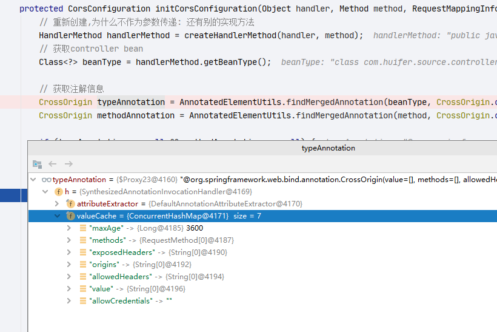
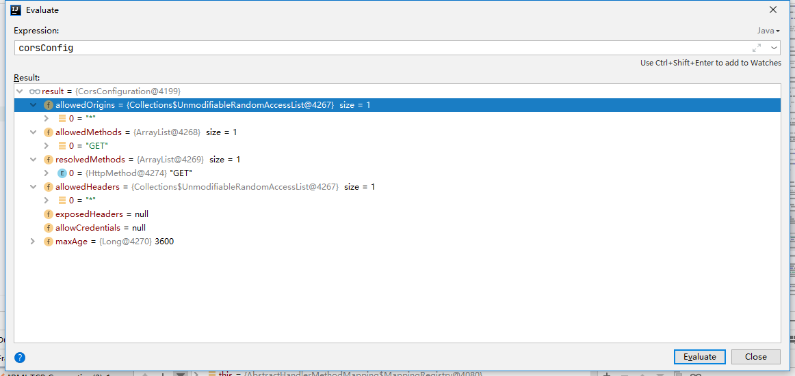
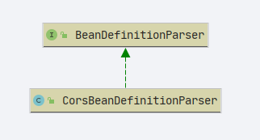
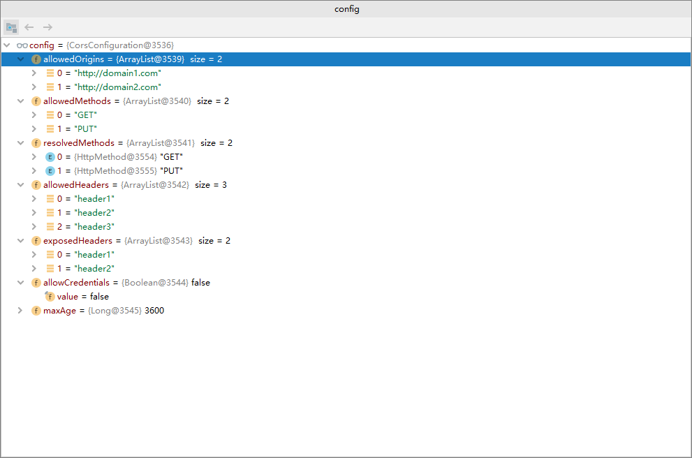
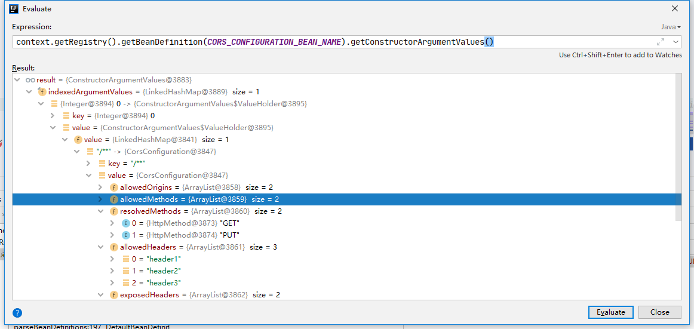
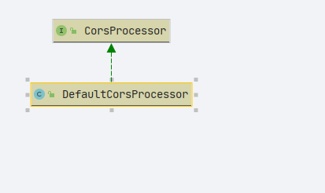
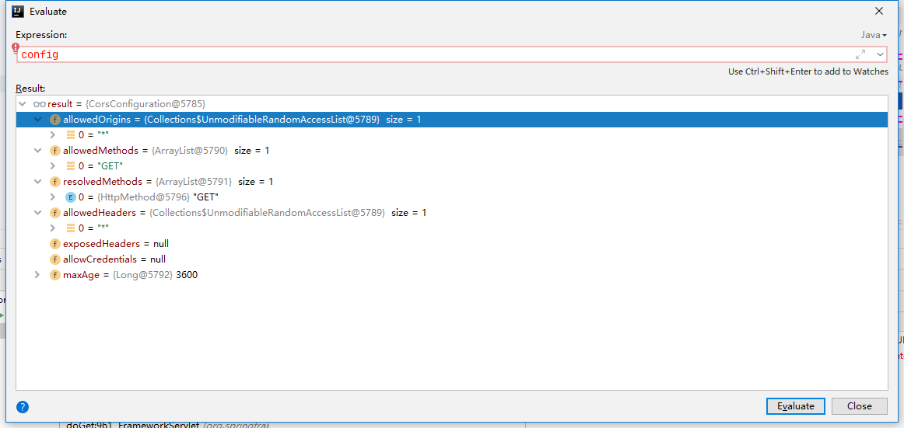

# Spring-MVC 跨域


## CrossOrigin注解

- 通过注解设置跨域 demo 如下

```java
package com.huifer.source.controller;

import org.springframework.web.bind.annotation.*;

import java.util.HashMap;

@CrossOrigin(maxAge = 3600)
@RequestMapping("/")
@RestController
public class JSONController {
    @ResponseBody
    @GetMapping(value = "/json")
    public Object ob() {
        HashMap<String, String> hashMap = new HashMap<>();
        hashMap.put("1", "a");
        return hashMap;
    }
}

```


- 切入点: 

  - `org.springframework.web.servlet.handler.AbstractHandlerMethodMapping#registerHandlerMethod`

    - `org.springframework.web.servlet.handler.AbstractHandlerMethodMapping.MappingRegistry#register`方法

    ```java
            /**
             * 注册方法 将controller 相关信息存储
             *
             * @param mapping 请求地址
             * @param handler 处理类
             * @param method  函数
             */
            public void register(T mapping, Object handler, Method method) {
                // 上锁
                this.readWriteLock.writeLock().lock();
                try {
                    // 创建 HandlerMethod , 通过 handler 创建处理的对象(controller)
                    HandlerMethod handlerMethod = createHandlerMethod(handler, method);
                    assertUniqueMethodMapping(handlerMethod, mapping);
                    // 设置值
                    this.mappingLookup.put(mapping, handlerMethod);
    
                    // 获取url
                    List<String> directUrls = getDirectUrls(mapping);
                    for (String url : directUrls) {
                        // 设置
                        this.urlLookup.add(url, mapping);
                    }
    
                    String name = null;
                    if (getNamingStrategy() != null) {
                        name = getNamingStrategy().getName(handlerMethod, mapping);
                        addMappingName(name, handlerMethod);
                    }
    
                    /**
                     * 跨域设置
                     * {@link org.springframework.web.servlet.mvc.method.annotation.RequestMappingHandlerMapping#initCorsConfiguration(Object, Method, RequestMappingInfo)}
                     **/
                    CorsConfiguration corsConfig = initCorsConfiguration(handler, method, mapping);
                    if (corsConfig != null) {
                        this.corsLookup.put(handlerMethod, corsConfig);
                    }
    
                    this.registry.put(mapping, new MappingRegistration<>(mapping, handlerMethod, directUrls, name));
                }
                finally {
                    // 开锁
                    this.readWriteLock.writeLock().unlock();
                }
            }
    
    ```

- 着重查看**`CorsConfiguration`**初始化方法

  - `org.springframework.web.servlet.mvc.method.annotation.RequestMappingHandlerMapping#initCorsConfiguration`

```JAVA
@Override
    protected CorsConfiguration initCorsConfiguration(Object handler, Method method, RequestMappingInfo mappingInfo) {
        // 重新创建,为什么不作为参数传递: 还有别的实现方法
        HandlerMethod handlerMethod = createHandlerMethod(handler, method);
        // 获取bean
        Class<?> beanType = handlerMethod.getBeanType();

        // 获取注解信息
        CrossOrigin typeAnnotation = AnnotatedElementUtils.findMergedAnnotation(beanType, CrossOrigin.class);
        CrossOrigin methodAnnotation = AnnotatedElementUtils.findMergedAnnotation(method, CrossOrigin.class);

        if (typeAnnotation == null && methodAnnotation == null) {
            return null;
        }

        CorsConfiguration config = new CorsConfiguration();
        // 更新跨域信息
        updateCorsConfig(config, typeAnnotation);
        updateCorsConfig(config, methodAnnotation);

        if (CollectionUtils.isEmpty(config.getAllowedMethods())) {
            for (RequestMethod allowedMethod : mappingInfo.getMethodsCondition().getMethods()) {
                config.addAllowedMethod(allowedMethod.name());
            }
        }
        // 返回跨域配置默认值
        return config.applyPermitDefaultValues();
    }
```


信息截图:





### updateCorsConfig

- 该方法对原有的配置信息做补充

```java
    private void updateCorsConfig(CorsConfiguration config, @Nullable CrossOrigin annotation) {
        if (annotation == null) {
            return;
        }
        for (String origin : annotation.origins()) {
            config.addAllowedOrigin(resolveCorsAnnotationValue(origin));
        }
        for (RequestMethod method : annotation.methods()) {
            config.addAllowedMethod(method.name());
        }
        for (String header : annotation.allowedHeaders()) {
            config.addAllowedHeader(resolveCorsAnnotationValue(header));
        }
        for (String header : annotation.exposedHeaders()) {
            config.addExposedHeader(resolveCorsAnnotationValue(header));
        }

        String allowCredentials = resolveCorsAnnotationValue(annotation.allowCredentials());
        if ("true".equalsIgnoreCase(allowCredentials)) {
            config.setAllowCredentials(true);
        }
        else if ("false".equalsIgnoreCase(allowCredentials)) {
            config.setAllowCredentials(false);
        }
        else if (!allowCredentials.isEmpty()) {
            throw new IllegalStateException("@CrossOrigin's allowCredentials value must be \"true\", \"false\", " +
                    "or an empty string (\"\"): current value is [" + allowCredentials + "]");
        }

        if (annotation.maxAge() >= 0 && config.getMaxAge() == null) {
            config.setMaxAge(annotation.maxAge());
        }
    }

```


最终解析结果




- 解析完成后放入	`corsLookup`对象中 类:**`org.springframework.web.servlet.handler.AbstractHandlerMethodMapping`**

  ```java
                  if (corsConfig != null) {
                      this.corsLookup.put(handlerMethod, corsConfig);
                  }
  
  ```

  


## xml 配置方式

```xml
    <mvc:cors>
        <mvc:mapping path="/**"
                     allowed-origins="http://domain1.com, http://domain2.com"
                     allowed-methods="GET, PUT"
                     allowed-headers="header1, header2, header3"
                     exposed-headers="header1, header2" allow-credentials="false"
                     max-age="3600" />

        <mvc:mapping path="/**"
                     allowed-origins="http://domain1.com" />
    </mvc:cors>
```

- `mvc`标签解析类: `org.springframework.web.servlet.config.MvcNamespaceHandler`，这个类对Spring配置文件中的`<mvc:xxx>`标签做了解析设定，如这次我们的关注点**`CORS`**

  ```java
  public class MvcNamespaceHandler extends NamespaceHandlerSupport {
  
      /**
       * 初始化一些SpringMvc 的解析类
       */
      @Override
      public void init() {
          // 注解驱动
          registerBeanDefinitionParser("annotation-driven", new AnnotationDrivenBeanDefinitionParser());
          // 默认的 servlet 处理器
          registerBeanDefinitionParser("default-servlet-handler", new DefaultServletHandlerBeanDefinitionParser());
          // 拦截器
          registerBeanDefinitionParser("interceptors", new InterceptorsBeanDefinitionParser());
          // 资源
          registerBeanDefinitionParser("resources", new ResourcesBeanDefinitionParser());
          // 视图控制器
          registerBeanDefinitionParser("view-controller", new ViewControllerBeanDefinitionParser());
          // 重定向视图控制器
          registerBeanDefinitionParser("redirect-view-controller", new ViewControllerBeanDefinitionParser());
          registerBeanDefinitionParser("status-controller", new ViewControllerBeanDefinitionParser());
          // 视图解析器
          registerBeanDefinitionParser("view-resolvers", new ViewResolversBeanDefinitionParser());
          // tiles 处理器
          registerBeanDefinitionParser("tiles-configurer", new TilesConfigurerBeanDefinitionParser());
  
          registerBeanDefinitionParser("freemarker-configurer", new FreeMarkerConfigurerBeanDefinitionParser());
          registerBeanDefinitionParser("groovy-configurer", new GroovyMarkupConfigurerBeanDefinitionParser());
  
          registerBeanDefinitionParser("script-template-configurer", new ScriptTemplateConfigurerBeanDefinitionParser());
          // 跨域处理
          registerBeanDefinitionParser("cors", new CorsBeanDefinitionParser());
      }
  
  }
  
  ```

  


### CorsBeanDefinitionParser

#### 类图



#### 解析

- 实现**BeanDefinitionParser** 接口的都有一个**parse**方法直接看方法.
  - 通过查看我们可以知道最终目的获取xml标签中的属性,对 **CorsConfiguration**进行初始化，最后Spring中注册

```JAVA
public class CorsBeanDefinitionParser implements BeanDefinitionParser {

    @Override
    @Nullable
    public BeanDefinition parse(Element element, ParserContext parserContext) {

        Map<String, CorsConfiguration> corsConfigurations = new LinkedHashMap<>();
        List<Element> mappings = DomUtils.getChildElementsByTagName(element, "mapping");

        if (mappings.isEmpty()) {
            // 最简配置
            CorsConfiguration config = new CorsConfiguration().applyPermitDefaultValues();
            corsConfigurations.put("/**", config);
        }
        else {
            // 单个 mapping 处理
            // mvc:mapping 标签
            for (Element mapping : mappings) {
                // 跨域配置
                CorsConfiguration config = new CorsConfiguration();
                // 处理每个属性值,并且赋值
                if (mapping.hasAttribute("allowed-origins")) {
                    String[] allowedOrigins = StringUtils.tokenizeToStringArray(mapping.getAttribute("allowed-origins"), ",");
                    config.setAllowedOrigins(Arrays.asList(allowedOrigins));
                }
                if (mapping.hasAttribute("allowed-methods")) {
                    String[] allowedMethods = StringUtils.tokenizeToStringArray(mapping.getAttribute("allowed-methods"), ",");
                    config.setAllowedMethods(Arrays.asList(allowedMethods));
                }
                if (mapping.hasAttribute("allowed-headers")) {
                    String[] allowedHeaders = StringUtils.tokenizeToStringArray(mapping.getAttribute("allowed-headers"), ",");
                    config.setAllowedHeaders(Arrays.asList(allowedHeaders));
                }
                if (mapping.hasAttribute("exposed-headers")) {
                    String[] exposedHeaders = StringUtils.tokenizeToStringArray(mapping.getAttribute("exposed-headers"), ",");
                    config.setExposedHeaders(Arrays.asList(exposedHeaders));
                }
                if (mapping.hasAttribute("allow-credentials")) {
                    config.setAllowCredentials(Boolean.parseBoolean(mapping.getAttribute("allow-credentials")));
                }
                if (mapping.hasAttribute("max-age")) {
                    config.setMaxAge(Long.parseLong(mapping.getAttribute("max-age")));
                }
                corsConfigurations.put(mapping.getAttribute("path"), config.applyPermitDefaultValues());
            }
        }

        // 注册到 Spring
        MvcNamespaceUtils.registerCorsConfigurations(
                corsConfigurations, parserContext, parserContext.extractSource(element));
        return null;
    }

}
```

- 属性截图

  

  - 可以看出这个是我们的第一个跨域配置的信息


- 注册方法

  ```java
      public static RuntimeBeanReference registerCorsConfigurations(
              @Nullable Map<String, CorsConfiguration> corsConfigurations,
              ParserContext context, @Nullable Object source) {
          // 判断是否包含跨域bean(beanName:mvcCorsConfigurations)
          if (!context.getRegistry().containsBeanDefinition(CORS_CONFIGURATION_BEAN_NAME)) {
              RootBeanDefinition corsDef = new RootBeanDefinition(LinkedHashMap.class);
              corsDef.setSource(source);
              corsDef.setRole(BeanDefinition.ROLE_INFRASTRUCTURE);
              if (corsConfigurations != null) {
                  corsDef.getConstructorArgumentValues().addIndexedArgumentValue(0, corsConfigurations);
              }
              context.getReaderContext().getRegistry().registerBeanDefinition(CORS_CONFIGURATION_BEAN_NAME, corsDef);
              // 注册组件,并且通知监听器
              context.registerComponent(new BeanComponentDefinition(corsDef, CORS_CONFIGURATION_BEAN_NAME));
          }
          else if (corsConfigurations != null) {
              // 注册bean
              BeanDefinition corsDef = context.getRegistry().getBeanDefinition(CORS_CONFIGURATION_BEAN_NAME);
              corsDef.getConstructorArgumentValues().addIndexedArgumentValue(0, corsConfigurations);
          }
          return new RuntimeBeanReference(CORS_CONFIGURATION_BEAN_NAME);
      }
  
  ```

- 


## CorsConfiguration

- 跨域信息

```JAVA
  /**
     * 允许请求源
     */
    @Nullable
    private List<String> allowedOrigins;

    /**
     * 允许的http方法
     */
    @Nullable
    private List<String> allowedMethods;

    /**
     *
     */
    @Nullable
    private List<HttpMethod> resolvedMethods = DEFAULT_METHODS;

    /**
     * 允许的请求头
     */
    @Nullable
    private List<String> allowedHeaders;

    /**
     * 返回的响应头
     */
    @Nullable
    private List<String> exposedHeaders;

    /**
     * 是否允许携带 cookies
     */
    @Nullable
    private Boolean allowCredentials;

    /**
     * 存货有效期
     */
    @Nullable
    private Long maxAge;
```


## 处理请求

- 请求处理的一部分，前置后置都还有其他处理，这里只对跨域请求进行说明

  ```java
      @Override
      @Nullable
      public final HandlerExecutionChain getHandler(HttpServletRequest request) throws Exception {
          Object handler = getHandlerInternal(request);
          if (handler == null) {
              handler = getDefaultHandler();
          }
          if (handler == null) {
              return null;
          }
          // Bean name or resolved handler?
          if (handler instanceof String) {
              String handlerName = (String) handler;
              handler = obtainApplicationContext().getBean(handlerName);
          }
  
          HandlerExecutionChain executionChain = getHandlerExecutionChain(handler, request);
  
          if (logger.isTraceEnabled()) {
              logger.trace("Mapped to " + handler);
          }
          else if (logger.isDebugEnabled() && !request.getDispatcherType().equals(DispatcherType.ASYNC)) {
              logger.debug("Mapped to " + executionChain.getHandler());
          }
  
          // 判断是否为跨域请求
          if (CorsUtils.isCorsRequest(request)) {
              CorsConfiguration globalConfig = this.corsConfigurationSource.getCorsConfiguration(request);
              // 当前请求的跨域配置
              CorsConfiguration handlerConfig = getCorsConfiguration(handler, request);
              CorsConfiguration config = (globalConfig != null ? globalConfig.combine(handlerConfig) : handlerConfig);
              executionChain = getCorsHandlerExecutionChain(request, executionChain, config);
          }
  
          return executionChain;
      }
  
  ```

### 判断是否跨域

- `org.springframework.web.cors.CorsUtils#isCorsRequest`

```java
    public static boolean isCorsRequest(HttpServletRequest request) {
        // 是否携带 请求头:Origin
        return (request.getHeader(HttpHeaders.ORIGIN) != null);
    }

```

### 获取跨域信息

```java
        // 判断是否为跨域请求
        if (CorsUtils.isCorsRequest(request)) {
            CorsConfiguration globalConfig = this.corsConfigurationSource.getCorsConfiguration(request);
            // 当前请求的跨域配置
            CorsConfiguration handlerConfig = getCorsConfiguration(handler, request);
            CorsConfiguration config = (globalConfig != null ? globalConfig.combine(handlerConfig) : handlerConfig);
            executionChain = getCorsHandlerExecutionChain(request, executionChain, config);
        }

```


### 跨域拦截器创建

```java
    protected HandlerExecutionChain getCorsHandlerExecutionChain(HttpServletRequest request,
                                                                 HandlerExecutionChain chain, @Nullable CorsConfiguration config) {

        if (CorsUtils.isPreFlightRequest(request)) {
            HandlerInterceptor[] interceptors = chain.getInterceptors();
            chain = new HandlerExecutionChain(new PreFlightHandler(config), interceptors);
        }
        else {
            // 创建跨域拦截器
            chain.addInterceptor(new CorsInterceptor(config));
        }
        return chain;
    }

```


### 跨域拦截器

```java
    /**
     * 跨域拦截器
     */
    private class CorsInterceptor extends HandlerInterceptorAdapter implements CorsConfigurationSource {

        @Nullable
        private final CorsConfiguration config;

        public CorsInterceptor(@Nullable CorsConfiguration config) {
            this.config = config;
        }

        @Override
        public boolean preHandle(HttpServletRequest request, HttpServletResponse response, Object handler)
                throws Exception {

            return corsProcessor.processRequest(this.config, request, response);
        }

        @Override
        @Nullable
        public CorsConfiguration getCorsConfiguration(HttpServletRequest request) {
            return this.config;
        }
    }

```


### DefaultCorsProcessor

- 经过跨域拦截器 **`CorsInterceptor`**之后会调用




```JAVA
    @Override
    @SuppressWarnings("resource")
    public boolean processRequest(@Nullable CorsConfiguration config, HttpServletRequest request,
                                  HttpServletResponse response) throws IOException {

        // 判断是否跨域请求
        if (!CorsUtils.isCorsRequest(request)) {
            return true;
        }

        ServletServerHttpResponse serverResponse = new ServletServerHttpResponse(response);
        // 判断是否有 Access-Control-Allow-Origin
        if (responseHasCors(serverResponse)) {
            logger.trace("Skip: response already contains \"Access-Control-Allow-Origin\"");
            return true;
        }

        ServletServerHttpRequest serverRequest = new ServletServerHttpRequest(request);
        if (WebUtils.isSameOrigin(serverRequest)) {
            logger.trace("Skip: request is from same origin");
            return true;
        }

        boolean preFlightRequest = CorsUtils.isPreFlightRequest(request);
        if (config == null) {
            if (preFlightRequest) {
                rejectRequest(serverResponse);
                return false;
            }
            else {
                return true;
            }
        }

        return handleInternal(serverRequest, serverResponse, config, preFlightRequest);
    }

```


### 模拟请求

```
GET http://localhost:9999/json
Origin: localhost
```

变量截图


