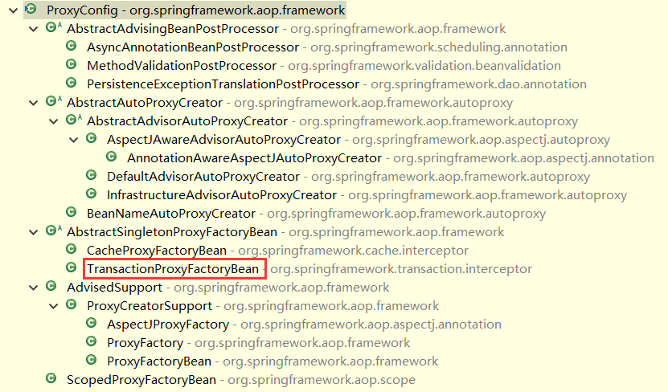

JavaEE应用 中的事务处理是一个重要并且涉及范围很广的领域。事务管理的实现往往涉及并发和数据一致性方面的问题。作为应用平台的 Spring，具有在多种环境中配置和使用事务处理的能力，也就是说通过使用 Spring 的事务组件，可以把事务处理的工作统一起来，并为事务处理提供通用的支持。

在涉及单个数据库局部事务的事务处理中，事务的最终实现和数据库的支持是紧密相关的。对局部数据库事务来说，一个事务处理的操作单元往往对应着一系列的数据库操作。数据库产品对这些数据库的 SQL操作 已经提供了原子性的支持，对 SQL操作 而言,它的操作结果有两种: 一种是提交成功，数据库操作成功；另一种是回滚，数据库操作不成功，恢复到操作以前的状态。

在事务处理中，事务处理单元的设计与相应的业务逻辑设计有很紧密的联系。在很多情况下，一个业务逻辑处理不会只有一个单独的数据库操作，而是有一组数据库操作。在这个处理过程中，首先涉及的是事务处理单元划分的问题，Spring 借助 IoC容器 的强大配置能力，为应用提供了声明式的事务划分方式，这种声明式的事务处理，为 Spring应用 使用事务管理提供了统一的方式。有了 Spring事务管理 的支持，只需要通过一些简单的配置，应用就能完成复杂的事务处理工作，从而为用户使用事务处理提供很大的方便。
## 1 Spring事务处理 的设计概览
Spring事务处理模块 的类层次结构如下图所示。

从上图可以看到，Spring事务处理模块 是通过 AOP功能 来实现声明式事务处理的，比如事务属性的配置和读取，事务对象的抽象等。因此，在 Spring事务处理 中，可以通过设计一个 TransactionProxyFactoryBean 来使用 AOP功能，通过这个 TransactionProxyFactoryBean 可以生成 Proxy代理对象，在这个代理对象中，通过 TransactionInterceptor 来完成对代理方法的拦截，正是这些 AOP 的拦截功能，将事务处理的功能编织进来。

对于具体的事务处理实现，比如事务的生成、提交、回滚、挂起等，由于不同的底层数据库有不同的支持方式，因此，在 Spring事务处理中，对主要的事务实现做了一个抽象和适配。适配的具体事务处理器包括：对 DataSource数据源 的事务处理支持，对 Hibernate数据源 的事务处理支持，对 JDO数据源 的事务处理支持，对 JPA 和 JTA 等数据源的事务处理支持等。这一系列的事务处理支持，都是通过设计 PlatformTransactionManager、AbstractPlatformTransactionManager 以及一系列具体事务处理器来实现的，而 PlatformTransactionManager 又实现了 TransactionInterceptor接口，通过这样一个接口实现设计，就把这一系列的事务处理的实现与前面提到的 TransactionProxyFactoryBean 结合起来，从而形成了一个 Spring声明式事务处理 的设计体系。

## 2 Spring事务处理 的应用场景
Spring 作为应用平台或框架的设计出发点是支持 POJO的开发，这点在实现事务处理的时候也不例外。在 Spring 中，它既支持编程式事务管理方式，又支持声明式事务处理方式，在使用 Spring 处理事务的时候，声明式事务处理通常比编程式事务管理更方便些。

Spring 对应用的支持，一方面，通过声明式事务处理，将事务处理的过程和业务代码分离出来。这种声明方式实际上是通过 AOP 的方式来完成的。显然，Spring 已经把那些通用的事务处理过程抽象出来，并通过 AOP 的方式进行封装，然后用声明式的使用方式交付给客户使用。这样，应用程序可以更简单地管理事务，并且只需要关注事务的处理策略。另一方面，应用在选择数据源时可能会采取不同的方案，当以 Spring 作为平台时，Spring 在应用和具体的数据源之间，搭建一个中间平台，通过这个中间平台，解耦应用和具体数据源之间的绑定，并且，Spring 为常用的数据源的事务处理支持提供了一系列的 TransactionManager。这些 Spring 封装好的 TransactionManager 为应用提供了很大的方便，因为在这些具体事务处理过程中，已经根据底层的实现，封装好了事务处理的设置以及与特定数据源相关的特定事务处理过程，这样应用在使用不同的数据源时，可以做到事务处理的即开即用。这样的另一个好处是，如果应用有其他的数据源事务处理需要， Spring 也提供了一种一致的方式。这种 有机的事务过程抽象 和 具体的事务处理 相结合的设计，是我们在日常的开发中非常需要模仿学习的。
