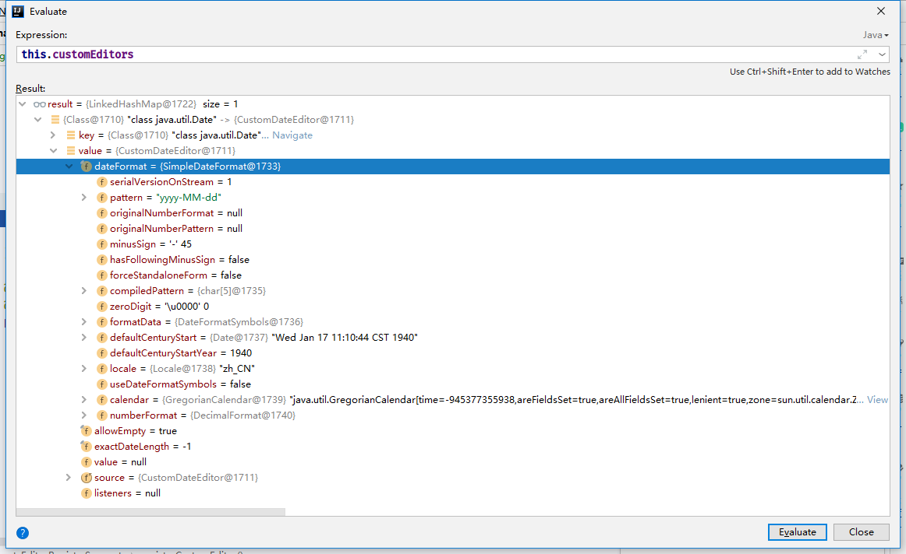
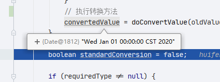

# Spring 自定义属性解析器
- Author: [HuiFer](https://github.com/huifer)
- 源码阅读仓库: [SourceHot-Spring](https://github.com/SourceHot/spring-framework-read)

## 用例
```xml
<?xml version="1.0" encoding="UTF-8"?>
<beans xmlns:xsi="http://www.w3.org/2001/XMLSchema-instance"
       xmlns="http://www.springframework.org/schema/beans"
       xsi:schemaLocation="http://www.springframework.org/schema/beans http://www.springframework.org/schema/beans/spring-beans.xsd">

    <bean class="org.springframework.beans.factory.config.CustomEditorConfigurer">
        <property name="propertyEditorRegistrars">
            <list>
                <bean class="com.huifer.source.spring.bean.DatePropertyRegister"/>
            </list>
        </property>

        <property name="customEditors">
            <map>
                <entry key="java.util.Date" value="com.huifer.source.spring.bean.DatePropertyEditor">
                </entry>
            </map>
        </property>
    </bean>
    <bean id="apple" class="com.huifer.source.spring.bean.Apple">
        <property name="date" value="2020-01-01 01:01:01"/>
    </bean>
</beans>
```

```java
public class DatePropertyRegister implements PropertyEditorRegistrar {
    @Override
    public void registerCustomEditors(PropertyEditorRegistry registry) {
        registry.registerCustomEditor(Date.class, new CustomDateEditor(
                new SimpleDateFormat("yyyy-MM-dd"), true)
        );
    }
}
```

```java
public class DatePropertyEditor extends PropertyEditorSupport {
    private String format = "yyyy-MM-dd";

    public String getFormat() {
        return format;
    }

    public void setFormat(String format) {
        this.format = format;
    }

    @Override
    public void setAsText(String text) throws IllegalArgumentException {
        System.out.println(text);
        SimpleDateFormat sdf = new SimpleDateFormat(format);
        try {
            Date date = sdf.parse(text);
            this.setValue(date);
        } catch (Exception e) {
            e.printStackTrace();

        }
    }

}
```

## PropertyEditorRegistrar解析
- 直接在`DatePropertyRegister`打上断点进行查看注册流程

  

  直接看调用堆栈获取调用层次

```java
    @Override
    public void registerCustomEditor(Class<?> requiredType, PropertyEditor propertyEditor) {
        registerCustomEditor(requiredType, null, propertyEditor);
    }

```


```java
    @Override
    public void registerCustomEditor(@Nullable Class<?> requiredType, @Nullable String propertyPath, PropertyEditor propertyEditor) {
        if (requiredType == null && propertyPath == null) {
            throw new IllegalArgumentException("Either requiredType or propertyPath is required");
        }
        if (propertyPath != null) {
            if (this.customEditorsForPath == null) {
                this.customEditorsForPath = new LinkedHashMap<>(16);
            }
            this.customEditorsForPath.put(propertyPath, new CustomEditorHolder(propertyEditor, requiredType));
        }
        else {
            if (this.customEditors == null) {
                this.customEditors = new LinkedHashMap<>(16);
            }
            // 放入 customEditors map对象中
            this.customEditors.put(requiredType, propertyEditor);
            this.customEditorCache = null;
        }
    }

```

- `PropertyEditorRegistrySupport`

  

  此处对象是通过`DatePropertyRegister`传递的

- `org.springframework.beans.factory.support.AbstractBeanFactory#registerCustomEditors`

```java
    protected void registerCustomEditors(PropertyEditorRegistry registry) {
        PropertyEditorRegistrySupport registrySupport =
                (registry instanceof PropertyEditorRegistrySupport ? (PropertyEditorRegistrySupport) registry : null);
        if (registrySupport != null) {
            registrySupport.useConfigValueEditors();
        }
        if (!this.propertyEditorRegistrars.isEmpty()) {
            for (PropertyEditorRegistrar registrar : this.propertyEditorRegistrars) {
                try {
                    /**
                     * {@link ResourceEditorRegistrar#registerCustomEditors(org.springframework.beans.PropertyEditorRegistry)}或者
                     * {@link PropertyEditorRegistrar#registerCustomEditors(org.springframework.beans.PropertyEditorRegistry)}
                     */
                    registrar.registerCustomEditors(registry);
                }
                catch (BeanCreationException ex) {
                    Throwable rootCause = ex.getMostSpecificCause();
                    if (rootCause instanceof BeanCurrentlyInCreationException) {
                        BeanCreationException bce = (BeanCreationException) rootCause;
                        String bceBeanName = bce.getBeanName();
                        if (bceBeanName != null && isCurrentlyInCreation(bceBeanName)) {
                            if (logger.isDebugEnabled()) {
                                logger.debug("PropertyEditorRegistrar [" + registrar.getClass().getName() +
                                        "] failed because it tried to obtain currently created bean '" +
                                        ex.getBeanName() + "': " + ex.getMessage());
                            }
                            onSuppressedException(ex);
                            continue;
                        }
                    }
                    throw ex;
                }
            }
        }
        if (!this.customEditors.isEmpty()) {
            this.customEditors.forEach((requiredType, editorClass) ->
                    registry.registerCustomEditor(requiredType, BeanUtils.instantiateClass(editorClass)));
        }
    }

```

- `void registerCustomEditors(PropertyEditorRegistry registry);` 用例中编写的`DatePropertyRegister`正好有这个方法的实现

·

- 在`AbstractBeanFactory`中查看变量


- 为什么最后结果变成`com.huifer.source.spring.bean.DatePropertyEditor`

  看配置文件

  ```xml
          <property name="customEditors">
              <map>
                  <entry key="java.util.Date" value="com.huifer.source.spring.bean.DatePropertyEditor">
                  </entry>
              </map>
          </property>
  
  ```

  - 对应的set方法

    ```java
        public void setCustomEditors(Map<Class<?>, Class<? extends PropertyEditor>> customEditors) {
            this.customEditors = customEditors;
        }
    ```

    


## applyPropertyValues

- 应用属性值

  

  ```java
      protected void applyPropertyValues(String beanName, BeanDefinition mbd, BeanWrapper bw, PropertyValues pvs) {
          if (pvs.isEmpty()) {
              return;
          }
  
          if (System.getSecurityManager() != null && bw instanceof BeanWrapperImpl) {
              ((BeanWrapperImpl) bw).setSecurityContext(getAccessControlContext());
          }
  
          MutablePropertyValues mpvs = null;
          // 没有解析的属性
          List<PropertyValue> original;
  
          if (pvs instanceof MutablePropertyValues) {
              mpvs = (MutablePropertyValues) pvs;
              if (mpvs.isConverted()) {
                  //MutablePropertyValues 对象中存在转换后对象直接赋值
                  // Shortcut: use the pre-converted values as-is.
                  try {
                      bw.setPropertyValues(mpvs);
                      return;
                  }
                  catch (BeansException ex) {
                      throw new BeanCreationException(
                              mbd.getResourceDescription(), beanName, "Error setting property values", ex);
                  }
              }
              original = mpvs.getPropertyValueList();
          }
          else {
              original = Arrays.asList(pvs.getPropertyValues());
          }
          // 自定义转换器
          TypeConverter converter = getCustomTypeConverter();
          if (converter == null) {
              converter = bw;
          }
          //  创建BeanDefinitionValueResolver
          BeanDefinitionValueResolver valueResolver = new BeanDefinitionValueResolver(this, beanName, mbd, converter);
  
          // Create a deep copy, resolving any references for values.
          // 解析后的对象集合
          List<PropertyValue> deepCopy = new ArrayList<>(original.size());
          boolean resolveNecessary = false;
          for (PropertyValue pv : original) {
              // 解析过的属性
              if (pv.isConverted()) {
                  deepCopy.add(pv);
              }
              // 没有解析过的属性
              else {
                  // 属性名称
                  String propertyName = pv.getName();
                  // 属性值,直接读取到的
                  Object originalValue = pv.getValue();
                  // 解析值
                  Object resolvedValue = valueResolver.resolveValueIfNecessary(pv, originalValue);
                  Object convertedValue = resolvedValue;
                  /**
                   * 1. isWritableProperty: 属性可写
                   * 2. isNestedOrIndexedProperty: 是否循环嵌套
                   */
                  boolean convertible = bw.isWritableProperty(propertyName) &&
                          !PropertyAccessorUtils.isNestedOrIndexedProperty(propertyName);
                  if (convertible) {
                      // 转换器解析
                      convertedValue = convertForProperty(resolvedValue, propertyName, bw, converter);
                  }
                  // Possibly store converted value in merged bean definition,
                  // in order to avoid re-conversion for every created bean instance.
                  if (resolvedValue == originalValue) {
                      if (convertible) {
                          // 设置解析值
                          pv.setConvertedValue(convertedValue);
                      }
                      deepCopy.add(pv);
                  }
                  // 类型解析
                  else if (convertible && originalValue instanceof TypedStringValue &&
                          !((TypedStringValue) originalValue).isDynamic() &&
                          !(convertedValue instanceof Collection || ObjectUtils.isArray(convertedValue))) {
                      pv.setConvertedValue(convertedValue);
                      deepCopy.add(pv);
                  }
                  else {
                      resolveNecessary = true;
                      deepCopy.add(new PropertyValue(pv, convertedValue));
                  }
              }
          }
          if (mpvs != null && !resolveNecessary) {
              // 转换成功的标记方法
              mpvs.setConverted();
          }
  
          // Set our (possibly massaged) deep copy.
          try {
              bw.setPropertyValues(new MutablePropertyValues(deepCopy));
          }
          catch (BeansException ex) {
              throw new BeanCreationException(
                      mbd.getResourceDescription(), beanName, "Error setting property values", ex);
          }
      }
  
  ```

  

  

  


- 属性值解析

  

  ```JAVA
      @Nullable
      private Object convertForProperty(
              @Nullable Object value, String propertyName, BeanWrapper bw, TypeConverter converter) {
  
          if (converter instanceof BeanWrapperImpl) {
              return ((BeanWrapperImpl) converter).convertForProperty(value, propertyName);
          }
          else {
              PropertyDescriptor pd = bw.getPropertyDescriptor(propertyName);
              MethodParameter methodParam = BeanUtils.getWriteMethodParameter(pd);
              return converter.convertIfNecessary(value, pd.getPropertyType(), methodParam);
          }
      }
  
  ```

  

```JAVA
    private Object doConvertTextValue(@Nullable Object oldValue, String newTextValue, PropertyEditor editor) {
        try {
            editor.setValue(oldValue);
        }
        catch (Exception ex) {
            if (logger.isDebugEnabled()) {
                logger.debug("PropertyEditor [" + editor.getClass().getName() + "] does not support setValue call", ex);
            }
            // Swallow and proceed.
        }
        // 调用子类实现方法
        editor.setAsText(newTextValue);
        return editor.getValue();
    }

```


- 调用用例编写的方法

  ```JAVA
      @Override
      public void setAsText(String text) throws IllegalArgumentException {
          System.out.println(text);
          SimpleDateFormat sdf = new SimpleDateFormat(format);
          try {
              Date date = sdf.parse(text);
              this.setValue(date);
          } catch (Exception e) {
              e.printStackTrace();
  
          }
      }
  
  ```

  



该值也是这个方法的返回`org.springframework.beans.TypeConverterDelegate#convertIfNecessary(java.lang.String, java.lang.Object, java.lang.Object, java.lang.Class<T>, org.springframework.core.convert.TypeDescriptor)`

