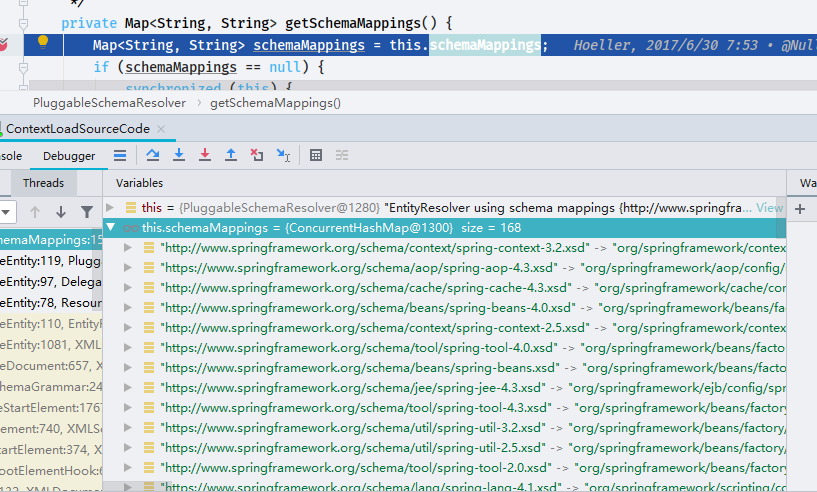
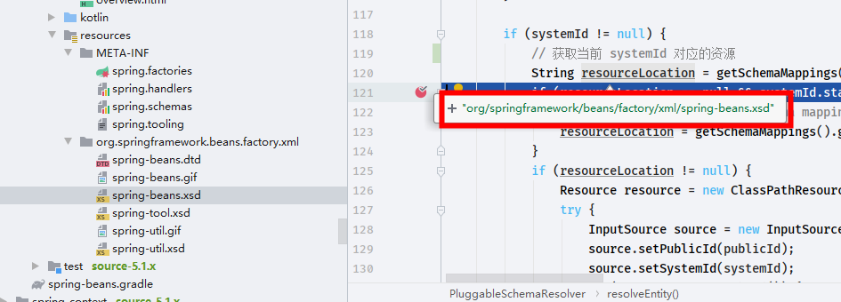
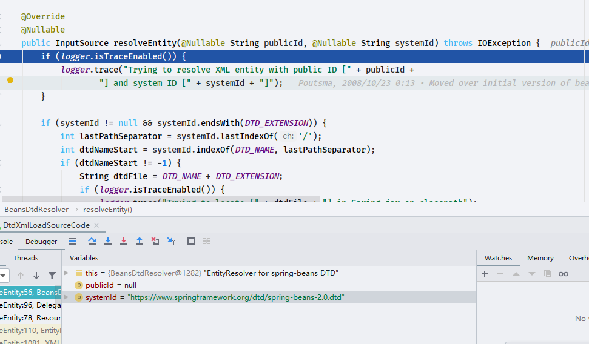

# EntityResolver
- Author: [HuiFer](https://github.com/huifer)
- 源码阅读仓库: [huifer-spring](https://github.com/huifer/spring-framework)
- 源码路径: `org.xml.sax.EntityResolver`,非Spring类

## DelegatingEntityResolver#resolveEntity
- org.springframework.beans.factory.xml.DelegatingEntityResolver.resolveEntity
```java
    @Override
    @Nullable
    public InputSource resolveEntity(@Nullable String publicId, @Nullable String systemId)
            throws SAXException, IOException {

        if (systemId != null) {
            if (systemId.endsWith(DTD_SUFFIX)) {
                return this.dtdResolver.resolveEntity(publicId, systemId);
            }
            else if (systemId.endsWith(XSD_SUFFIX)) {
                return this.schemaResolver.resolveEntity(publicId, systemId);
            }
        }

        // Fall back to the parser's default behavior.
        return null;
    }

```
- 上述这段代码是针对xml进行校验
```xml
<beans xmlns:xsi="http://www.w3.org/2001/XMLSchema-instance"
       xmlns="http://www.springframework.org/schema/beans"
       xsi:schemaLocation="http://www.springframework.org/schema/beans http://www.springframework.org/schema/beans/spring-beans.xsd">
```
- 如上所示以`.xsd`结尾,应该执行` return this.schemaResolver.resolveEntity(publicId, systemId);`方法
`http://www.springframework.org/schema/beans/spring-beans.xsd`
- `org.springframework.beans.factory.xml.PluggableSchemaResolver.resolveEntity`
## PluggableSchemaResolver#resolveEntity
```java
    @Override
    @Nullable
    public InputSource resolveEntity(@Nullable String publicId, @Nullable String systemId) throws IOException {
        if (logger.isTraceEnabled()) {
            logger.trace("Trying to resolve XML entity with public id [" + publicId +
                    "] and system id [" + systemId + "]");
        }

        if (systemId != null) {
            // 获取当前 systemId 对应的资源
            // spring-framework\spring-beans\src\main\resources\org\springframework\beans\factory\xml\spring-beans.xsd
            String resourceLocation = getSchemaMappings().get(systemId);
            if (resourceLocation == null && systemId.startsWith("https:")) {
                // Retrieve canonical http schema mapping even for https declaration
                resourceLocation = getSchemaMappings().get("http:" + systemId.substring(6));
            }
            if (resourceLocation != null) {
                // 加载 resourceLocation 转换成 Resource
                Resource resource = new ClassPathResource(resourceLocation, this.classLoader);
                try {
                    // 读取
                    InputSource source = new InputSource(resource.getInputStream());
                    source.setPublicId(publicId);
                    source.setSystemId(systemId);
                    if (logger.isTraceEnabled()) {
                        logger.trace("Found XML schema [" + systemId + "] in classpath: " + resourceLocation);
                    }
                    return source;
                }
                catch (FileNotFoundException ex) {
                    if (logger.isDebugEnabled()) {
                        logger.debug("Could not find XML schema [" + systemId + "]: " + resource, ex);
                    }
                }
            }
        }

        // Fall back to the parser's default behavior.
        return null;
    }

```





得到本地路径，后续直接返回读取资源

## BeansDtdResolver#resolveEntity

创建一个Dtd的约束文件

```xml
<?xml version="1.0" encoding="UTF-8"?>
<beans xmlns="http://www.springframework.org/schema/beans"
       xmlns:xsi="http://www.w3.org/2001/XMLSchema-instance"
       xsi:schemaLocation="http://www.springframework.org/schema/beans https://www.springframework.org/dtd/spring-beans-2.0.dtd">

</beans>
```

```java
    @Override
    @Nullable
    public InputSource resolveEntity(@Nullable String publicId, @Nullable String systemId) throws IOException {
        if (logger.isTraceEnabled()) {
            logger.trace("Trying to resolve XML entity with public ID [" + publicId +
                    "] and system ID [" + systemId + "]");
        }

        if (systemId != null && systemId.endsWith(DTD_EXTENSION)) {
            int lastPathSeparator = systemId.lastIndexOf('/');
            int dtdNameStart = systemId.indexOf(DTD_NAME, lastPathSeparator);
            if (dtdNameStart != -1) {
                // 获取静态变量组装成文件名称(spring-beans.dtd)
                String dtdFile = DTD_NAME + DTD_EXTENSION;
                if (logger.isTraceEnabled()) {
                    logger.trace("Trying to locate [" + dtdFile + "] in Spring jar on classpath");
                }
                try {
                    // 加载资源
                    Resource resource = new ClassPathResource(dtdFile, getClass());
                    InputSource source = new InputSource(resource.getInputStream());
                    source.setPublicId(publicId);
                    source.setSystemId(systemId);
                    if (logger.isTraceEnabled()) {
                        logger.trace("Found beans DTD [" + systemId + "] in classpath: " + dtdFile);
                    }
                    return source;
                }
                catch (FileNotFoundException ex) {
                    if (logger.isDebugEnabled()) {
                        logger.debug("Could not resolve beans DTD [" + systemId + "]: not found in classpath", ex);
                    }
                }
            }
        }

        // Fall back to the parser's default behavior.
        return null;
    }

```


- systemId `https://www.springframework.org/dtd/spring-beans-2.0.dtd`




## 总结

- DelegatingEntityResolver#resolveEntity,是对xml文档的校验前置步骤,根据`dtd`和`xsd`加载本地资源文件
    `spring-framework\spring-beans\src\main\resources\org\springframework\beans\factory\xml\spring-beans.dtd`
    `spring-framework\spring-beans\src\main\resources\org\springframework\beans\factory\xml\spring-beans.xsd`
- `PluggableSchemaResolver`负责加载`xsd`文件
- `BeansDtdResolver`负责加载`dtd`文件